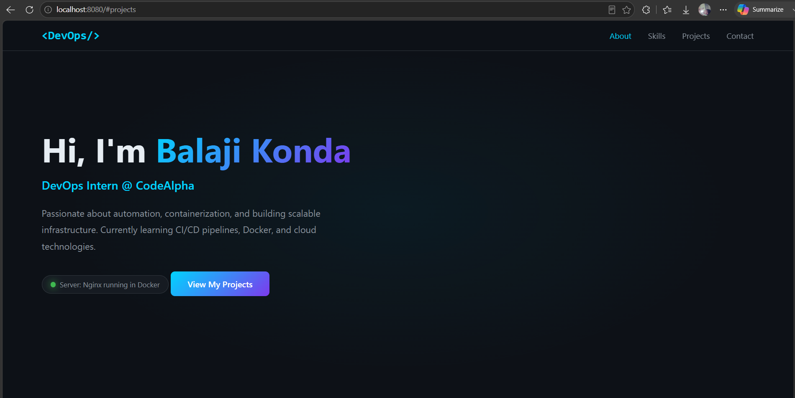
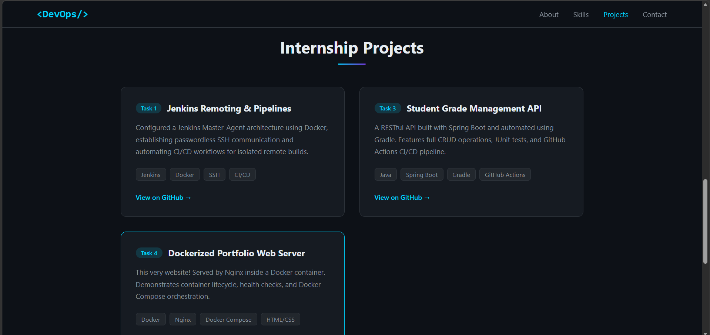

# 🌐 Dockerized Portfolio Web Server


A containerized modern web server serving a responsive developer portfolio using **Nginx (Alpine)**, orchestrating the container lifecycle with **Docker Compose**, and integrating a validation pipeline with **GitHub Actions**.

This project implements **Task 4 of the CodeAlpha DevOps Internship**. It covers building optimized Docker images, writing custom server configurations, managing persistent logging volumes, checking container health, and validating builds via automated workflows.

---

## 🏗️ Technical Architecture
- **Web Content:** HTML5, CSS3 (Outfit & JetBrains Mono typography), Vanilla JavaScript
- **Web Server:** Nginx (Alpine-based, ultra-lightweight ~23 MB image)
- **Containerization:** Docker 24+
- **Orchestration:** Docker Compose v2 (3.8 Schema)
- **CI/CD:** GitHub Actions (verifies build, runs container, tests server health, performs cleanup)

---

## ⚙️ Configuration Highlights

### 1. Custom Nginx Server (`nginx.conf`)
- **Gzip Compression:** Enabled for textual and JSON/XML files to heavily optimize network performance.
- **Client Cache Control:** Aggressive 30-day caching (`expires 30d`) for static assets to reduce server load and latency.
- **SPA Fallback:** Redirects `404` errors back to `index.html`.
- **Persistent Logging:** Redirects server access and error logs to `/var/log/nginx/` inside the container (mapped to host volumes via Compose).

### 2. Multi-Stage Dockerfile (`Dockerfile`)
- **Alpine Base:** Reduces security attack surface and drastically speeds up pull/push times.
- **Health Check:** Runs every 30 seconds using `wget` to verify that Nginx is actively responding.
- **Metadata Labels:** Standardizes build metadata (`maintainer`, `version`, `description`).

### 3. Docker Compose (`docker-compose.yml`)
- **Resource Limits:** Protects the host node by restricting the container to `50% CPU` and `128M` memory.
- **Named Volumes:** Persists Nginx access/error log files locally via `nginx_logs`.

---

## 🚀 Getting Started

### Prerequisites
- **Docker Desktop** installed and running on your host machine.

### Build and Run via Docker Compose (Recommended)
Docker Compose abstracts container parameters and automates mounting persistent volume logs.

1. **Spin up the stack (rebuilds and runs in background):**
   ```bash
   docker compose up -d --build
   ```
2. **Verify Serving:**
   Open your web browser and navigate to 👉 **[http://localhost:8080](http://localhost:8080)**

3. **View live Nginx logging stream:**
   ```bash
   docker compose logs -f
   ```
4. **Shut down the stack and delete persistent log volumes:**
   ```bash
   docker compose down -v
   ```

### Manual Docker CLI Commands
| Action | Command |
|---|---|
| **Build Image** | `docker build -t nginx-portfolio:1.0 .` |
| **Run Container** | `docker run -d --name nginx-portfolio -p 8080:80 nginx-portfolio:1.0` |
| **Stop** | `docker stop nginx-portfolio` |
| **Status / Health** | `docker ps -f name=nginx-portfolio` |

---

## 🔄 Continuous Integration (GitHub Actions)
Every time code is pushed to the `main` branch or a Pull Request is opened, the `.github/workflows/docker-build.yml` pipeline triggers:
1. Builds the image from the `Dockerfile`.
2. Starts the container mapping port `8080`.
3. Pauses for initialization and runs a connection test via `curl`.
4. Inspects container health status using `docker inspect`.
5. Logs output stream and shuts down the test container cleanly.

---

## 📸 Output Screenshots

**Portfolio Interface (Task 4 UI):**


**Portfolio Content Details:**

